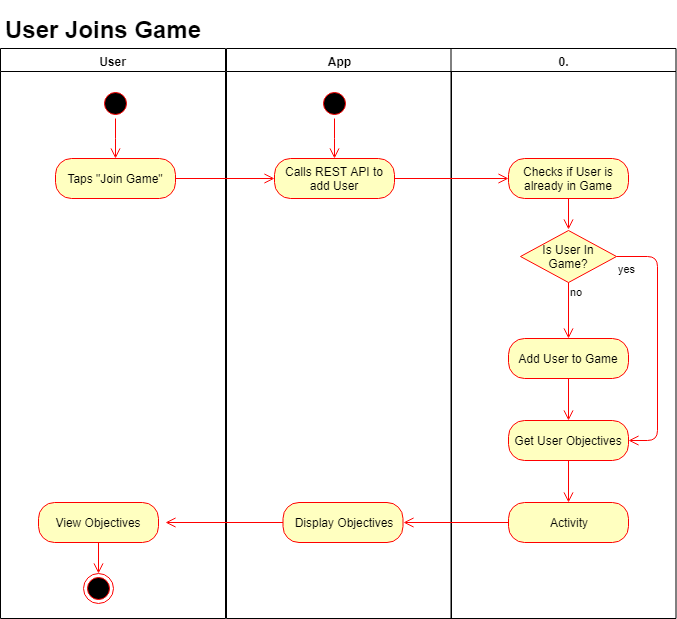
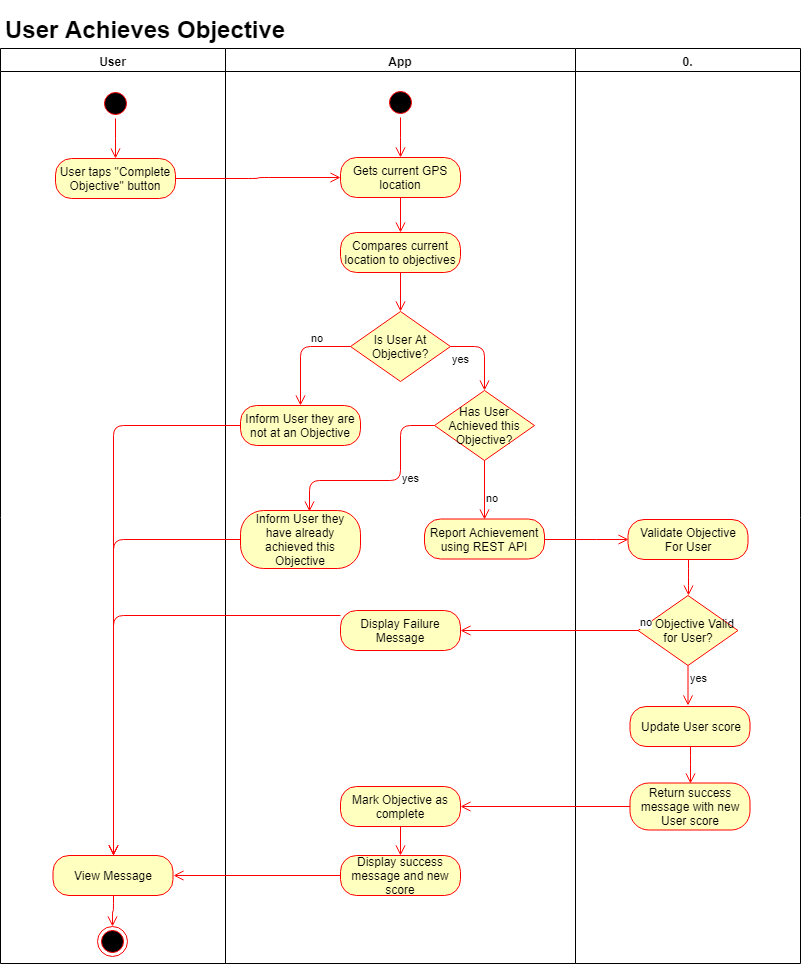
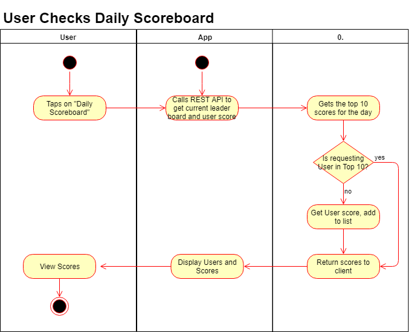

# Activity Diagrams

## Activity 1: User Joins Game

### Diagram

### Description

The user first hits the "Join Game" button in the application.  When the application sees the event raised, it makes a call to the RESTful API to add the user to the game.  The server will then determine if the user has been added to the game already, and if not, add the user.  Regardless of if the user has been previously added, the server then pulls together the current Objectives for the User and passes them to the application.  The application then displays the objectives to the user.

## Activity 2: User Reaches Objective

### Diagram

### Description

When a user arrives at a specified objective, they can open the app and press a button indicating that they are at one of the buildings on that days list.  At this point, the app will compare the GPS location of the user against that days objectives and determine if the user is at any of them.  If they are, it will confirm that they have not already achieved that objective.  If the user is at a new objective for the day, the app will post this to the REST API.  The server will validate that this objective is valid for this user and update the users score.  Should any validity check be failed along the way, the user will be shown an error message indicating what has gone wrong, otherwise, they will be shown a success message.

## Activity 3: User Views Daily Scoreboard

### Diagram

### Description

The user will tap a button asking to see that days leader board.  The app will then send this request and the users name on to the REST API.  The server will get the top 10 scores for the day and check if the User is on that list.  If the User is not on that list, their score will be retrieved and added to the list.  This list will be send back down to the client application which will then show the results to the User.