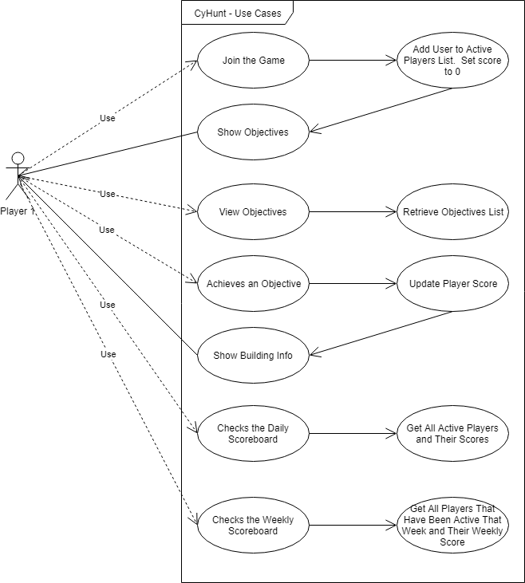
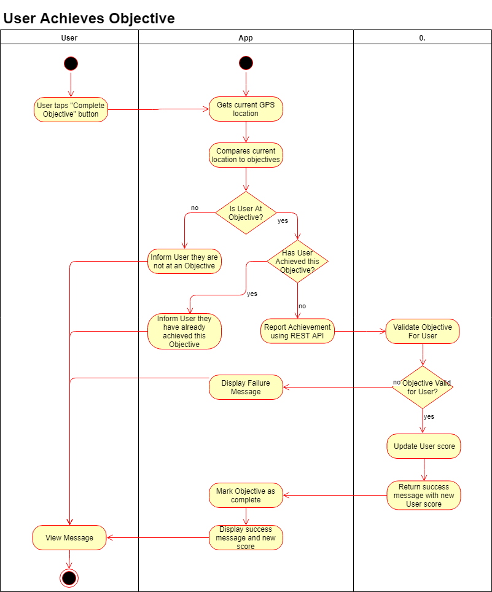

# CyHunt

Group 19  
William Schellekens  
Vincent Johnson  
Zechen Huang  
Riku Morishima  

---

## Project Description

CyHunt is an android application, which uses geo-fencing and gps technologies to take students on a scavenger hunt around campus to find points of interests (POIs) in a short amount of time. Their time finding locations will dictate their points and and rank on a ranking leaderboard. Bonus points can be earned by finding Cy at randomly generated locations.

### Goals/Objectives

1. Develop a well presented and user friendly client using Java
   * Easy to use client
   * Clean looking and presentable
2. Develop a robust server and database using Spring boot
   * Develope multiple database/tables for: POI locations, User Logins, Leaderboards
3. Incorporate GPS and geo-fencing technologies

### Final Outcome

A presentable application that provides entertainment in the form of a scavenger hunt with the use of Android, GPS, and GEO-Fencing technologies.

### Benefits

Application will help new/transfering students learn the locations of buildings on the Iowa State University campus and help with a easier transition to the university.

### Limitations

Mobile Platform - we only have access to Android developement tools  
Mobile Hardware - we will be accessing GPS which can be a huge draw on battery power.

        

---

## Use Case Diagram

          

---

## Activity Diagrams

### Activity 1: User Joins Game

          

### Activity 2: User Reaches Objective

          

### Activity 3: User Views Daily Scoreboard

---

## Use Case Descriptions

### User Joins the Game

1. The User taps on the Join Game button.
2. The client application calls the REST API.
3. The server checks if the User is already in the Game, if not, the User is added.
4. The server returns the list of objectives for that Game to the client.
5. The Client application stores daily game in SQLite database on device.
6. The client application displays a message indicating the user has been added and the objectives for the game.

    

### User Views Objectives

1. User taps View Objectives button.
2. Client application calls REST API requesting the objectives for the current game (only 1 per day).
3. The server retrieves the current Game objectives from the database.
4. The server returns results to the client application.
5. The client application displays objectives to the User.

### User Achieves Objective

1. User taps Objective Achieved button.
2. Client application compares current GPS location against stored objectives to determine if the user is at an objective, if not a message is shown indicating such.
3. If user is at an objective, the client application checks if that objective has already been retrieved, if so, a message is shown.
4. If the objective has not yet been achieved, the objective is marked as achieved and the REST API is called to marke the user as having achieved the objective.
5. The server checks that the User has not yet met the objective, if they have, a message is returned to the client which is then shown to the User.
6. If the User has not yet achieved the objective, the objective is marked as completed for the User, their score is updated, and a predefined informative message about the building is retrieved.
7. The points earned for that objective and total user daily and weekly scores are returned to the client application along with the building info message.
8. The client application shows a confirmation to the user along with the points earned, currently daily, currently weekly scores, and the info message about the building.

### User Checks Daily Scoreboard

1. The User taps on View Daily Scoreboard.
2. The client application calls the REST API.
3. The server gets the top 10 daily scores from the database.
4. THe server checks if the requesting User is in the top 10 list, if not the User and their score are added.
5. The server returns the list of scores to the client application.
6. The client application shows the list of scores to the User, highlighting their score.

### User Checks Weekly Scoreboard

1. The User taps on View Weekly Scoreboard.
2. The client application calls the REST API.
3. The server gets the top 10 weekly scores from the database.
4. THe server checks if the requesting User is in the top 10 list, if not the User and their score are added.
5. The server returns the list of scores to the client application.
6. The client application shows the list of scores to the User, highlighting their score.

   

---

## Implementation Outline

This project will be a three-tiered application.

1. The Presentation tier will be an Android application written in Java using SQLite for local storage.  This application will be written using Android studio IDE and tested on the groups devices.
2. The Business Logic tier will be a RESTful API written in Java using the Spring Boot framework.  This will be written using the IntelliJ IDE.
3. The Data Storage tier will be a MySQL database accessed using a Java Data Access Layer written using the Spring Boot framework.  This will be created using a code first approach using the ItelliJ IDE.