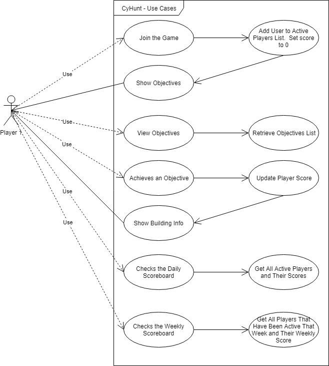

# Use Case Diagram

## Diagram

# Description

The game only has players, shown as Player 1.  Every day a new game is created by generating a list of 20 of the buildings on campus.  At this point players can choose to join the game.  When a player has joined the game, they can view the daily objectives.  The user can choose which objective to achieve next and once at that location can use the Android app to mark it as achieved (GPS data is used to validate that they are actually there).  When the user achieves the objective some information about the building is shown to educate the user about campus.  Users then gain the points earned based on how quickly objectives are completed.  

Users can also choose to view the Daily or Weekly scoreboard to compare their progress against each other.